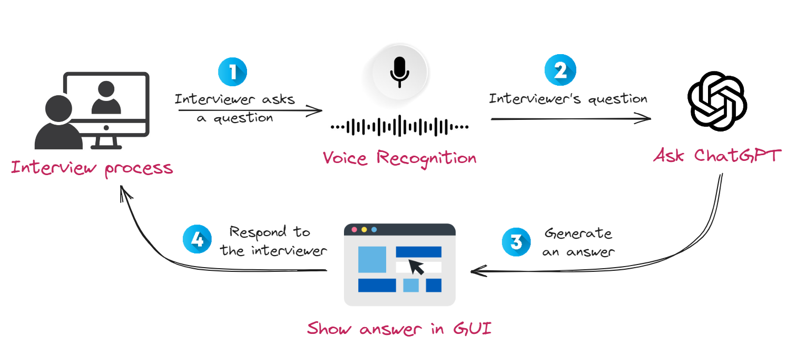

# Code for the article **[Hack Your Next Interview with Generative AI](https://slgero.medium.com/hack-your-next-interview-with-generative-ai-fb8c8bc3cbce)**

### Demo:


### Architecture:


### Usage:
```sh
pip install -r requirements.txt
python ./src/simple_ui.py
```

### Key Handling:

Ensure that your OpenAI key is stored as an enviornment variable like so. 

```sh
export OPENAI_API_KEY="your_api_key_here"
```

Optionally if using the DeepGram model for transcription.
```sh
export DEEPGRAM_API_KEY="your_api_key_here"
```
